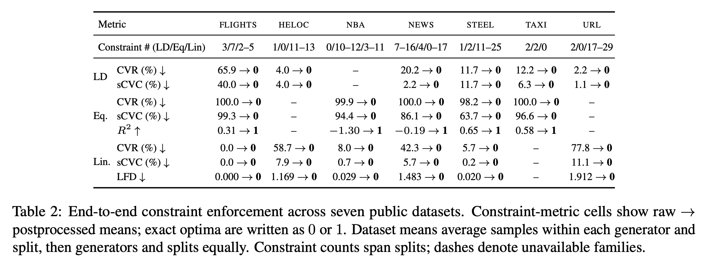

# DIVE: Discovery, Inter-Column Constraint, Validation, and Enforcement

This repository contains the code and experiment artifacts for the paper
[XXX](https://arxiv.org/abs/XXXX.XXXXX). The arXiv URL is a placeholder and
will be updated when the preprint is available.

**DIVE** stands for **D**iscovery, **I**nter-column constraint,
**V**alidation, and **E**nforcement. The codebase supports the paper’s workflow
for discovering relationships between columns in tabular data, validating the
resulting constraints, and enforcing them on synthetic data. It also includes
the frozen experiment configurations, discovered constraints, and evaluation
records used for the paper’s main experiments.

## Environment setup

Run all commands from the repository root. The environment is managed with
[`uv`](https://docs.astral.sh/uv/) and is fully resolved in `uv.lock`. Python
3.13.2 is recorded in `.python-version`.

Install `uv` if it is not already available, then create the environment and
install the locked dependencies:

```bash
uv sync --frozen
```

Run repository commands through `uv` so that they use this environment:

```bash
uv run python <script.py> [arguments]
```

Constraint discovery uses a hosted language model. The included experiment
configurations use OpenAI. Copy the environment-file template and add your API
key:

```bash
cp .env.example .env
```

```text
OPENAI_API_KEY=your_key_here
```

Do not commit `.env`. An `ANTHROPIC_API_KEY` is needed only if an experiment is
reconfigured to use Anthropic. See `ENVIRONMENT.md` for the recorded software
and hardware environment and the reproducibility boundary.

## Datasets

Processed dataset CSVs are not distributed in this repository. Each dataset
directory contains provenance metadata and a dedicated `README.md` explaining
the dataset, its public source, and how to create the required
`dataset/<name>/data.csv` file.

The seven datasets used in the main experiments are:

- `flights`
- `heloc`
- `nba`
- `news`
- `steel`
- `taxi`
- `url`

The `anxiety-categorical` directory contains an additional dataset used by the
categorical-constraint workflow. Some downloads use Kaggle and therefore may
require local Kaggle credentials. Consult the README in the relevant dataset
directory before running an experiment.

## Full rerun including constraint discovery

First follow the relevant dataset README to create
`dataset/<dataset>/data.csv`. The following example recreates the Taxi
experiment in a new output directory without modifying the frozen reference
files:

```bash
uv run python multirun_experiment.py prepare \
  --config experiments_multirun/taxi/experiment_config.json \
  --output-dir reproduced/taxi

uv run python multirun_experiment.py all \
  --experiment-dir reproduced/taxi
```

Replace `taxi` with any of the seven configured dataset names. The standard
configuration creates three splits with seeds 42, 43, and 44; trains CTGAN,
TVAE, Gaussian Copula, and TabDDPM; samples each trained generator three times;
postprocesses each sample; and evaluates raw and constrained variants.

This workflow performs constraint discovery through the configured hosted
language model, so it requires the corresponding API key and may incur API
costs. Hosted-model outputs can also change over time.

See `MULTIRUN_EXPERIMENTS.md` for stage-by-stage commands and configuration
details.

## Rerun using the frozen discovered constraints

To reproduce synthesis, postprocessing, and evaluation with the exact
constraints used for the reported results, first create the relevant
`dataset/<dataset>/data.csv` as described in its dataset README. Then:

1. Prepare a new experiment directory:

```bash
uv run python multirun_experiment.py prepare \
  --config experiments_multirun/taxi/experiment_config.json \
  --output-dir reproduced/taxi
```

2. Restore all three frozen constraint families for every split:

```bash
uv run python restore_frozen_constraints.py \
  experiments_multirun/taxi reproduced/taxi
```

The helper also accepts repeated exact-file overrides of the form
`--constraint-file SOURCE TARGET`; run it with `--help` for details.

3. Run synthesis, postprocessing, and evaluation:

```bash
uv run python multirun_experiment.py generate \
  --experiment-dir reproduced/taxi
uv run python multirun_experiment.py postprocess \
  --experiment-dir reproduced/taxi
uv run python multirun_experiment.py evaluate \
  --experiment-dir reproduced/taxi
```

Replace `taxi` with the desired configured dataset name in all paths. Each
split receives these frozen files:

```text
constraints/
├── categorical_dependency_constraint.json
├── equational_constraint.json
└── linear_constraint.json
```

This workflow avoids variability from hosted constraint discovery while still
rerunning model training, sampling, constraint enforcement, and evaluation.


## Produce the main result table

Run this workflow after completing the `evaluate` stage for all seven dataset
experiments. Each experiment directory must contain raw and constrained
`evaluation.json` files and a `real_metrics_cache.json` for every split.

Generate the per-dataset summaries and gather the paper table in one command:

```bash
uv run python evaluation/gather_main_table_results.py reproduced
```

The gather script automatically runs the summarization logic for every dataset
experiment directory under `reproduced/` before creating the combined table.
For each dataset, it writes:

```text
reproduced/<dataset>/
├── selected_evaluation_summary.json
└── selected_evaluation_summary.csv
```

The summarization step first averages repeated samples within each generator
and split, then averages generators equally within each split, and finally
reports the mean and sample standard deviation across splits. For downstream utility, it
selects the model with the highest mean real-data baseline score across splits:
TRTR R² for regression or TRTR ROC AUC for binary classification.

It then discovers `reproduced/*/selected_evaluation_summary.json`, reads
the corresponding split-level constraint files, and writes:

```text
reproduced/
├── main_table_results.csv
├── main_table_results.md
└── main_table_results.json
```

- `main_table_results.csv` contains the compact paper-table cells.
- `main_table_results.md` is a directly readable Markdown table with the
  postprocessed constraint endpoints in bold.
- `main_table_results.json` retains full-precision values, standard deviations,
  split counts, metric paths, utility-model selection, and per-split constraint
  counts.

The optional `--no-summarize` flag reuses existing selected summaries instead of
refreshing them.

The reported table shows raw → postprocessed means. Constraint counts span the
three splits, and a dash indicates that a constraint family is unavailable for
that dataset.


